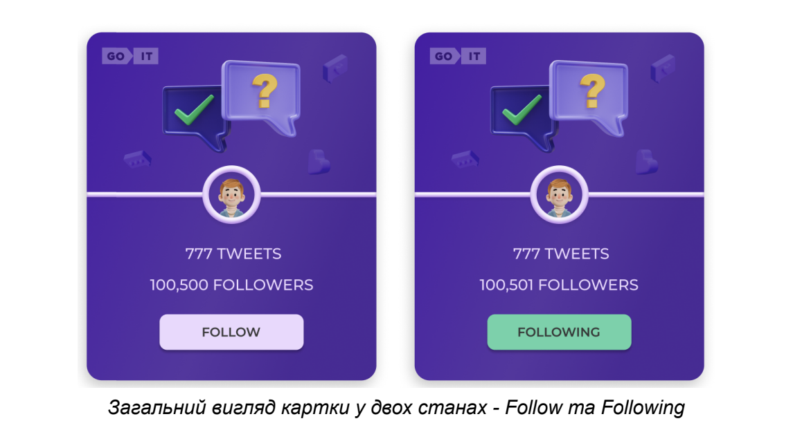
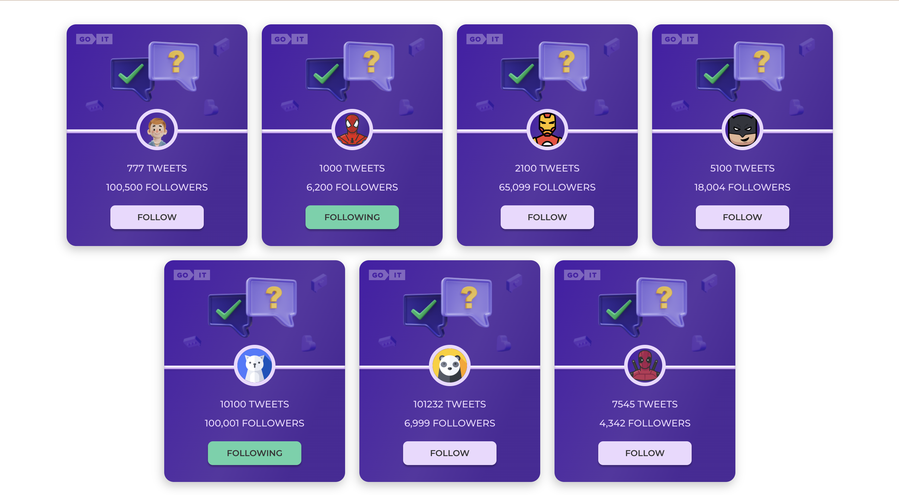

# Readme Test GoIT

Task: Create a user card according to the template with follow/unfollow
functionality



## Installation

Install with npm

```bash
  npm i
```

Start with npm

```bash
  npm start
```

## Result

- Created local user database
- Stylization made with styled-components
- Follow/unfollow functionality implemented with Redux Toolkit / Redux Persist
- Added filtering of the list of following users


